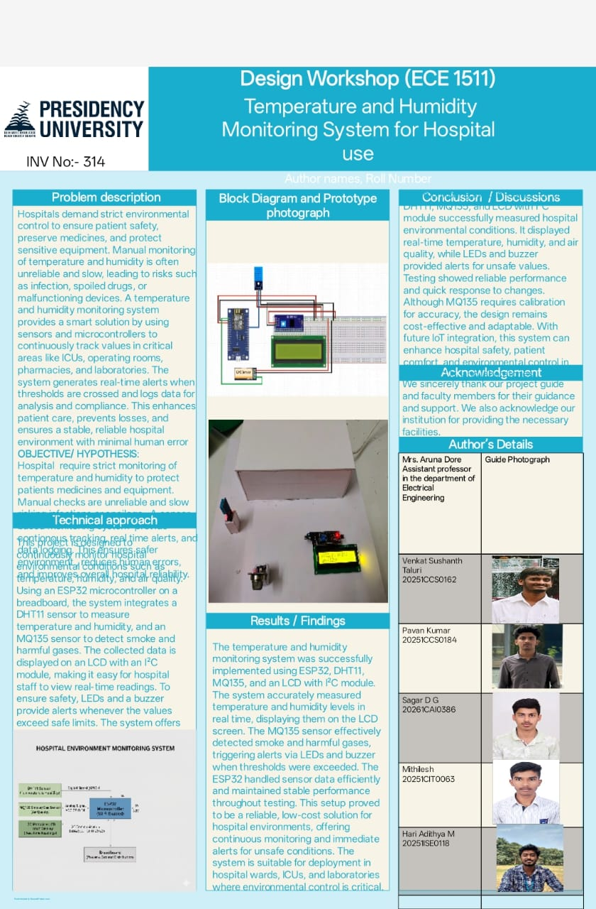

# hospital-environment-monitoring
Temperature and Humidity Monitoring system for Hospital Store Rooms 
## Project Images

### Prototype

### Demo / Setup

## About the Project
This project monitors temperature and humidity in hospital store rooms to ensure safe storage of medicines and equipment.
It helps prevent damage due to environmental changes and improves patient safety.

## Features
- Real-time temperature monitoring
- Real-time humidity monitoring
- Alerts when values exceed safe limits
- Low-cost and easy to deploy

## Tools & Technologies
- ESP32
- DHT11 
- LCD Display
- Arduino IDE
